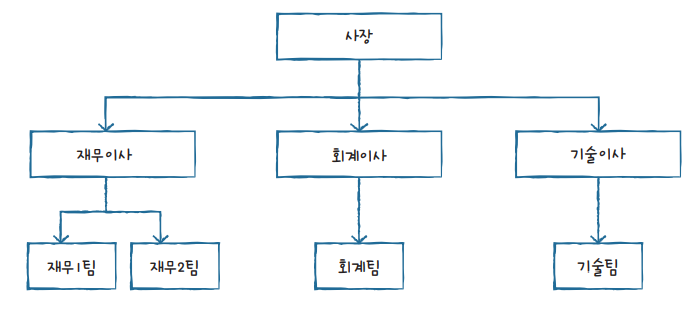
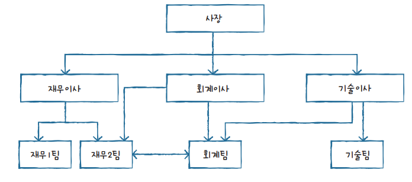
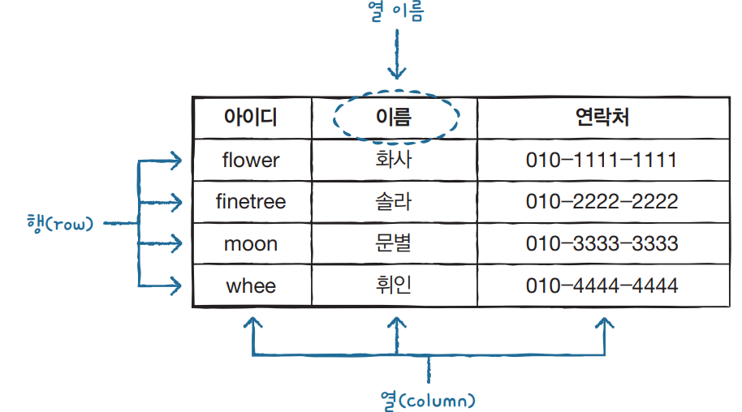

# 데이터베이스
데이터베이스를 한 마디로 정의하면 ‘데이터의 집합’이라고 할 수 있습니다.

데이터베이스에는 일상생활 대부분의 정보가 저장되고 관리됩니다. 오늘 보내거나 받은 카카오톡 메시지, 인스타그램에 등록한 사진, 버스/지하철에서 찍은 교통카드, 카페에서 구매한 아이스 아메리카노 등의 정보가 모두 데이터베이스에 기록됩니다.

## DBMS
데이터베이스를 ‘데이터의 집합’이라고 정의한다면, 이런 데이터베이스를 관리하고 운영하는 소프트웨어를 DBMS(Database Management System)라고 합니다. 다양한 데이터가 저장되어 있는 데이터베이스는 여러 명의 사용자나 응용 프로그램과 공유하고 동시에 접근이 가능해야 합니다.

가까운 예로 은행의 예금 계좌는 많은 사람들이 가지고 있습니다. 여러 명의 예금 계좌 정보를 모아 놓은 것이 데이터베이스입니다. 은행이 가지고 있는 예금 계좌 데이터베이스에는 여러 명이 동시에 접근할 수 있습니다. 예금 계좌 주인, 은행 직원, 인터넷 뱅킹, ATM 기기 등에서 모두 접근이 가능하니까요. 이러한 것이 가능한 이유는 바로 DBMS가 있기 때문입니다.

## DBMS 종류
DBMS와 같은 소프트웨어는 특정 목적을 처리하기 위한 프로그램입니다. 예를 들어 문서를 작성하기 위해서는 아래아한글(HWP)이나 워드(Word), 표 계산을 위해서는 엑셀(Excel)이나 캘크(Calc), 멋진 사진을 편집하려면 포토샵(PhotoShop)이나 김프(Gimp)와 같은 소프트웨어를 설치해야 합니다.

마찬가지로 데이터베이스를 사용하기 위해서도 소프트웨어, 즉 DBMS를 설치해야 하는데 대표적으로 MySQL, 오라클(Oracle), SQL 서버, MariaDB 등이 있습니다. 소프트웨어 각각의 사용 방법과 특징이 다르지만 특정 목적을 위해서는 어떤 것을 사용해도 무방합니다.

| DBMS        | 제작사       | 작동 운영체제                  | 기타                                         |
|-------------|--------------|-------------------------------|----------------------------------------------|
| MySQL       | Oracle       | Unix, Linux, Windows, Mac      | 오픈 소스(무료), 상용                        |
| MariaDB     | MariaDB      | Unix, Linux, Windows           | 오픈 소스(무료), MySQL 초기 개발자들이 독립  |
| PostgreSQL  | PostgreSQL   | Unix, Linux, Windows, Mac      | 오픈 소스(무료)                             |
| Oracle      | Oracle       | Unix, Linux, Windows           | 상용 시장 점유율 1위                        |
| SQL Server  | Microsoft    | Windows                        | 주로 중/대형급 시장에서 사용                |
| DB2         | IBM          | Unix, Linux, Windows           | 메인프레임 시장 점유율 1위                  |
| Access      | Microsoft    | Windows                        | PC용                                        |
| SQLite      | SQLite       | Android, iOS                   | 모바일 전용, 오픈 소스(무료)                |

## DBMS의 분류
DBMS의 유형은 계층형(Hierarchical), 망형(Network), 관계형(Relational), 객체지향형(Object-Oriented), 객체관계형(Object-Relational) 등으로 분류됩니다. 현재 사용되는 DBMS 중에는 관계형 DBMS가 가장 많은 부분을 차지하며, MySQL도 관계형 DBMS에 포함됩니다. 

### 계층형 DBMS
계층형 DBMS(Hierarchical DBMS)는 처음으로 등장한 DBMS 개념으로 1960년대에 시작되었습니다. 아래 그림과 같이 각 계층은 트리tree 형태를 갖습니다. 사장 1명에 이사 3명이 연결되어 있는 구조입니다. 계층형 DBMS의 문제는 처음 구성을 완료한 후에 이를 변경하기가 상당히 까다롭다는 것입니다. 또한 다른 구성원을 찾아가는 것이 비효율적입니다. 예를 들어 재무2팀에서 회계팀으로 연결하려면 재무이사 → 사장 → 회계이사 → 회계팀과 같이 여러 단계를 거쳐야 합니다. 지금은 사용하지 않는 형태입니다.

### 망형 DBMS
망형 DBMS(Network DBMS)는 계층형 DBMS의 문제점을 개선하기 위해 1970년대에 등장했습니다. 다음 그림을 보면 하위에 있는 구성원끼리도 연결된 유연한 구조입니다. 예를 들어 재무2팀에서 바로 회계팀으로 연결이 가능합니다. 하지만 망형 DBMS를 잘 활용하려면 프로그래머가 모든 구조를 이해해야만 프로그램 작성이 가능하다는 단점이 존재합니다. 역시 지금은 거의 사용하지 않는 형태입니다.

### 관계형 DBMS
관계형 DBMS(Relational DBMS)는 줄여서 RDBMS라고 부릅니다. MySQL뿐만 아니라, 대부분의 DBMS가 RDBMS 형태로 사용됩니다. RDBMS의 데이터베이스는 테이블(table)이라는 최소 단위로 구성되며, 이 테이블은 하나 이상의 열(column)과 행(row)으로 이루어져 있습니다.

한글이나 워드에서 표를 만들었던 경험이 있을텐데요, 이 표의 모양이 바로 테이블입니다. 친구의 카카오톡 아이디, 이름, 연락처 등 3가지 정보를 표, 즉 테이블로 만들면 다음과 같습니다.

DBMS에서는 모든 데이터가 테이블에 저장됩니다. 이 구조가 가장 기본적이고 중요한 구성이기 때문에 RDBMS는 테이블로 이루어져 있으며, 테이블은 열과 행으로 구성되어 있다는 것을 파악했다면 RDBMS를 어느정도 이해했다고 할 수 있습니다.

## 참고자료:
* [혼공: 데이터베이스 이해하기](https://hongong.hanbit.co.kr/%eb%8d%b0%ec%9d%b4%ed%84%b0%eb%b2%a0%ec%9d%b4%ec%8a%a4-%ec%9d%b4%ed%95%b4%ed%95%98%ea%b8%b0-databasedb-dbms-sql%ec%9d%98-%ea%b0%9c%eb%85%90/)