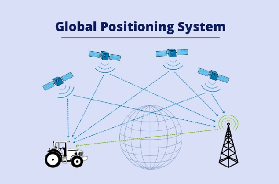

### GPS란?

GPS(Global Positioning System)는 전 세계 어디서나 정확한 위치를 제공하는 **위성 기반 네비게이션 시스템**입니다. 미국 정부가 개발하고 운영하며, 위성에서 보내는 신호를 통해 사용자는 자신의 위치, 속도, 그리고 시간을 실시간으로 확인할 수 있습니다.

### GPS의 구성

1. **GPS 위성 네트워크**: 약 30개의 위성이 지구 궤도를 돌며 위치와 시간 정보를 전송합니다.
2. **GPS 수신기**: 여러 위성으로부터 신호를 받아 삼각측량(trilateration)을 통해 수신기의 위치(위도, 경도, 고도)를 계산합니다. 수신기는 최소 4개의 위성 신호를 받아 정확한 위치를 계산합니다.

### GPS의 주요 특징

1. **정확성**: GPS는 높은 정확도를 제공하며, 다양한 분야에서 몇 미터에서 몇 센티미터 단위까지 정밀한 위치를 측정할 수 있습니다.
   
2. **전 세계적 사용 가능성**: GPS는 전 세계 어디서든 사용할 수 있어, 국제적인 네비게이션과 위치 기반 서비스에 적합합니다.

3. **실시간 업데이트**: GPS는 실시간으로 위치 정보를 갱신하며, 지속적인 신호 수신을 통해 사용자는 언제든 자신의 위치를 확인할 수 있습니다.

4. **광범위한 응용**: 자동차 내비게이션, 항공 및 해상 탐색, 군사 작전, 물류 관리 등 다양한 분야에서 활용됩니다.

5. **저렴한 비용**: GPS 수신기는 비교적 저렴하며, GPS 신호 자체는 무료로 사용할 수 있습니다.

6. **다른 네비게이션 시스템과 호환**: GPS는 GLONASS(러시아), 갈릴레오(유럽) 같은 다른 위성 네비게이션 시스템과도 호환됩니다.

### GPS의 유형

1. **핸드헬드 GPS**: 휴대용 GPS 기기로, 야외 활동(등산, 캠핑 등)에 사용됩니다.
   
2. **자동차 내비게이션**: 차량에 장착된 GPS로, 실시간 경로 안내와 교통 정보를 제공합니다.

3. **항공용 GPS**: 항공기의 정확한 비행 경로와 위치를 추적하는 데 사용됩니다.

4. **해상용 GPS**: 선박의 항해를 돕는 GPS로, 위치 추적과 경로 안내를 제공합니다.

5. **스포츠/야외 활동용 GPS**: 운동 경로나 야외 활동에서 위치와 성과를 추적하는 데 사용됩니다.

6. **웨어러블 GPS**: 스마트워치 같은 기기에 내장되어, 운동 추적과 위치 정보를 제공합니다.

### GPS의 활용 분야

1. **자동차 내비게이션**: 운전자에게 최적의 경로와 실시간 교통 정보를 제공합니다.
2. **항공 및 해상 탐색**: 항공기와 선박의 안전한 경로 설정과 이동을 돕습니다.
3. **군사 작전**: 병력과 장비의 위치 추적 및 작전 계획에 사용됩니다.
4. **물류 관리**: 차량과 화물의 위치를 실시간으로 추적하여 효율성을 높입니다.
5. **스포츠 및 야외 활동**: 운동 경로, 거리, 속도 등을 추적하여 성과 분석을 지원합니다.
6. **위치 기반 서비스(LBS)**: 스마트폰을 통해 주변 정보, 교통 상황 등을 제공합니다.
7. **공공 안전 및 긴급 대응**: 재난 구조 및 긴급 상황에서 신속한 대응을 지원합니다.

GPS는 정확한 위치 정보와 다양한 기능을 통해 일상생활과 산업 전반에서 중요한 역할을 하는 시스템입니다.

참고자료:
* [Wiki: GPS](https://en.wikipedia.org/wiki/Global_Positioning_System)