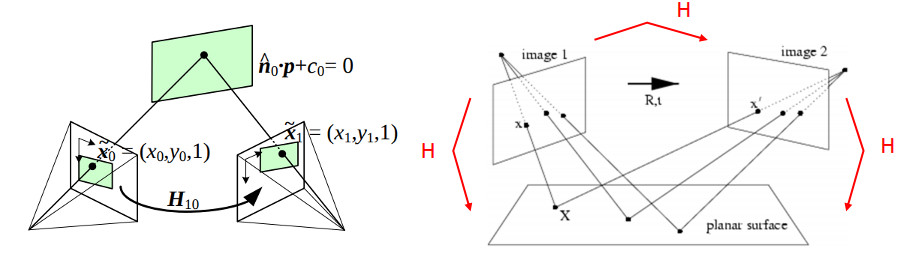

# 호모그래피(Homography)

호모그래피 (homography)는 서로 다른 카메라 뷰의 영상에 있는 두 평면 사이의 변환 또는 3차원 공간의 평면과 영상에 [원근 투영](../PerspectiveProjection/PerspectiveProjection.md)된 평면 사이의 변환행렬입니다. 즉 두 개의 2D 평면 사이의 관계를 나타내는 행렬입니다. 호모그래피는 파노라마 영상 생성, 영상 교정, 카메라 칼리브레이션 등에서 사용됩니다.

$$
  s
  \begin{bmatrix}
  x^{'} \\
  y^{'} \\
  1
  \end{bmatrix} = \mathbf{H}
  \begin{bmatrix}
  x \\
  y \\
  1
  \end{bmatrix} =
  \begin{bmatrix}
  h_{11} & h_{12} & h_{13} \\
  h_{21} & h_{22} & h_{23} \\
  h_{31} & h_{32} & h_{33}
  \end{bmatrix}
  \begin{bmatrix}
  x \\
  y \\
  1
  \end{bmatrix}
$$

 

 

아래는 호모그래피를 이용하여 다음의 것 등을 할 수 있습니다:
* 카메라 포즈 추정(Camera pose estimation)
* 원근 제거(Perspective removal / correction)
* 파노라마 합성(Panorama stitching)

 

참고자료:
* [Wiki: Homography](https://en.wikipedia.org/wiki/Homography)
* [OpenCV: Basic concepts of the homography explained with code](https://docs.opencv.org/4.x/d9/dab/tutorial_homography.html)