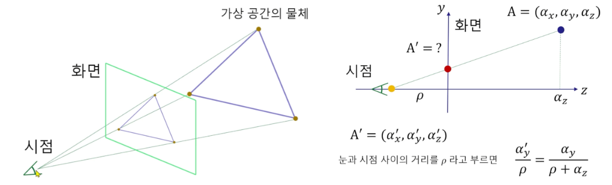

# Homography
* [Homography](https://en.wikipedia.org/wiki/Homography)

호모그래피 (homography)는 서로 다른 카메라 뷰의 영상에 있는 두 평면 사이의 변환 또는 3차원 공간의 평면과 영상에 투영된 평면 사이의 변환행렬입니다. 즉 두 개의 2D 평면 사이의 관계를 나타내는 행렬입니다. 호모그래피는 파노라마 영상 생성, 영상 교정, 카메라 칼리브레이션 등에서 사용됩니다.

 

## 원근 투영(Perspective Projection)
원근 투영(Perspective Projection)은 3D 좌표계에서 정의된 물체를 2D 평면(주로 화면)으로 변환하는 방식입니다. 이 과정에서, 실제 거리에 따라 물체의 크기가 변하는 현상이 자연스럽게 반영됩니다. 즉, 가까이 있는 물체는 크게, 멀리 있는 물체는 작게 보이게 됩니다.

$$x`=\frac{f⋅x}{z}, y`=\frac{f⋅y}{z}$$

* $f$는 카메라의 초점 거리(focal length)
* $x`, y`$는 2D 화면에서의 좌표
* x, y, z는 3D 공간에서의 좌표

 

### Interpolating Vertex Attributes(버텍스 어트리뷰트 보간)
* [Scratchapixel: Perspective Correct Interpolation 및 Vertex Attributes](https://www.scratchapixel.com/lessons/3d-basic-rendering/rasterization-practical-implementation/perspective-correct-interpolation-vertex-attributes.html)

