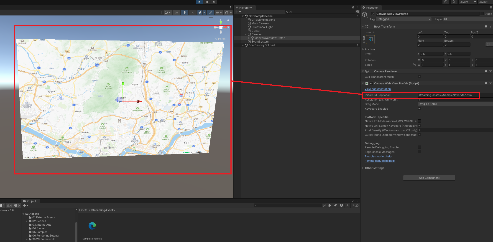

---
tags:
  - Unity
  - Map
  - VuplexWebView
---
# Unity에서 Naver Map API를 Web View로 보기
지도나 네비게이션등의 기능을 사용하기 위해 [Map API](../MapAPI/MapAPI.md)를 [WebView](../VuplexWebView/VuplexWebView.md)을 이용하여 Unity에 통합하는 예제 입니다.

## HTML 구성
지도를 보여줄 페이지를 구성합니다. 웹 페이지를 유니티에 통합하기 위해 지도가 전체화면으로 보이도록 합니다.

참고자료:
* [Github: Naver Map API 샘플](https://github.com/navermaps/maps.js.ncp/blob/master/examples/map/1-map-simple.html)

<br>

SampleNaverMap.html:
```html
<!DOCTYPE html>
<html>
<head>
    <meta charset="UTF-8">
    <meta http-equiv="X-UA-Compatible" content="IE=edge">
    <meta name="viewport" content="width=device-width, initial-scale=1.0, user-scalable=no">
    <title>전체화면 지도</title>
    <script src="../../docs/js/jquery-1.9.1.js"></script>
    <script type="text/javascript" src="../../docs/js/examples-base.js"></script>
    <script type="text/javascript" src="../../docs/js/highlight.min.js"></script>
    <!-- ncpClientId는 등록 환경에 따라 일반(ncpClientId), 공공(govClientId), 금융(finClientId)으로 나뉩니다. 사용하는 환경에 따라 키 이름을 변경하여 사용하세요. 참고: clientId(네이버 개발자 센터)는 지원 종료 -->
    <script type="text/javascript" src="https://oapi.map.naver.com/openapi/v3/maps.js?ncpClientId=83bfuniegk"></script>
    <style>
        /* HTML과 BODY를 전체 화면 크기로 설정 */
        html, body {
            margin: 0;
            padding: 0;
            width: 100%;
            height: 100%;
        }
        
        /* 지도 div를 전체 화면에 맞춤 */
        #map {
            width: 100%;
            height: 100%;
        }
    </style>
</head>
<body>
    <!-- 지도만 전체 화면에 표시 -->
    <div id="map"></div>
    <script>
        // 지도를 삽입할 HTML 요소 또는 HTML 요소의 id를 지정합니다.
        var mapDiv = document.getElementById('map');

        // 옵션 없이 지도 객체를 생성하면 서울 시청을 중심으로 하는 16 레벨의 지도가 생성됩니다.
        var map = new naver.maps.Map(mapDiv);
    </script>
</body>
</html>
```

## WebView로 Unity에서 HTML 로드
프로젝트에 `Assets/StreamingAssets` 디렉토리를 만들고, 작성한 `SampleNaverMap.html`을 둡니다.

WebView에 `streaming-assets://SampleNaverMap.html`을 url로 설정하여 불러올 수 있습니다.



참고자료:
* [Vuplex: How to load a local HTML or PDF file?](https://support.vuplex.com/articles/how-to-load-local-files)


## Web - Unity 연동
Web과 이벤트 및 데이터를 보내고 받을 수 있는 구조를 만듭니다.

* CSharp에서 WebViewPrefab.WebView.PostMessage로 메시지를 보내고, WebViewPrefab.WebView.MessageEmitted에 메시지 콜백을 등록합니다.
* Javascript에서 window.vuplex.postMessage로 메시지를 보내고, window.vuplex.addEventListener로 메시지 콜백을 등록합니다.

참고자료:
* [How to send messages from JavaScript to C# and vice versa?](https://support.vuplex.com/articles/how-to-send-messages-from-javascript-to-c-sharp)

<br>

GPSSampleScene.cs:
```CSharp
    public class GPSSampleScene : MonoBehaviour
    {
        [Header("WebView Prefab")]
        [SerializeField] private BaseWebViewPrefab m_webViewPrefab;

        private void Start()
        {
            StartCoroutine(InitializeWebView());
        }

        /// <summary>
        /// <para>WebView가 초기화 될때까지 기다리는 Enumerator입니다.</para>
        /// </summary>
        /// <returns></returns>
        private IEnumerator InitializeWebView()
        {
            // WebView가 초기화될 때까지 기다립니다.
            yield return m_webViewPrefab.WaitUntilInitialized();

            m_webViewPrefab.WebView.MessageEmitted += ReceiveWebViewMessageCallback;

            // WebView가 페이지 로드를 완료할 때까지 기다립니다.
            yield return m_webViewPrefab.WebView.WaitForNextPageLoadToFinish();
        }

        /// <summary>
        /// <para>WebView로부터 메시지를 받았을 때 호출됩니다.</para>
        /// </summary>
        /// <param name="sender"></param>
        /// <param name="eventArgs"></param>
        private void ReceiveWebViewMessageCallback(object sender, EventArgs<string> eventArgs)
        {
            Debug.Log("Rseceived message: " + eventArgs.Value);
        }   

        /// <summary>
        /// <para>WebView로 메시지를 보냅니다.</para>
        /// </summary>
        /// <param name="message"></param>
        private void SendWebViewMessage(string message)
        {
            //// example
            //m_webViewPrefab.WebView.PostMessage("{\"type\": \"greeting\", \"message\": \"Hello from C#!\"}");

            m_webViewPrefab.WebView.PostMessage(message);
        }
    }
```

<br>

SampleNaverMap.html:
```javascript
    <!-- 지도만 전체 화면에 표시 -->
    <div id="map"></div>
    <script>
        // 지도를 생성합니다.
        var mapDiv = document.getElementById('map');
        var map = new naver.maps.Map(mapDiv);

        naver.maps.Event.addListener(map, 'mousedown', function (e) {
            //console.log('마우스가 클릭됨');

            var str = '클릭한 위치의 위도는 ' + e.coord.y + '이고, ' + '경도는 ' + e.coord.x + '입니다.';
            var json = { type: 'click event', message: str };  
            sendMessageToCSharp(json);
        });

        // C#으로 메시지를 보내는 함수
        if (window.vuplex) {
            addMessageListener();
        } else {
            window.addEventListener('vuplexready', addMessageListener);
        }

        function addMessageListener() {
            window.vuplex.addEventListener('message', receiveMessageFromCSharpCallback);
        }

        function sendMessageToCSharp(message) {
            //window.vuplex.postMessage({ type: 'greeting', message: 'Hello from JavaScript!' });

            window.vuplex.postMessage(message);
        }

        function receiveMessageFromCSharpCallback(event) {
            console.log('Received message from C#: ' + event.data);
        }

    </script>
```