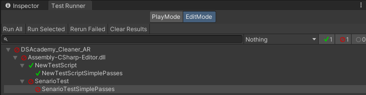
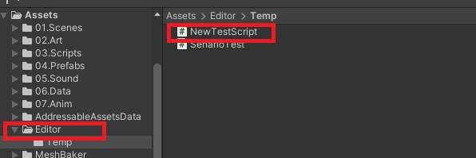

---
tags:
  - Unity
  - TestDrivenDevelopment
---
[TDD(Test Driven Development, 테스트 주도 개발)](../TestDrivenDevelopment/TestDrivenDevelopment.md)는 **테스트 케이스를 먼저 작성하고, 이를 통과하는 코드를 구현하는 반복적인 소프트웨어 개발 방법론**입니다. 이 방식은 코드를 개발하는 과정에서 피드백을 빠르게 받을 수 있게 하며, **프로그래머의 과도한 구현을 방지**하고 **코드의 품질을 높이는 효과**를 기대할 수 있습니다. 또한, 테스트 코드 작성 과정에서 과거 의사결정을 추적할 수 있는 **히스토리가 남아** 유지 보수에 유리합니다.

"테스트 케이스를 만들다 보면, 보이지 않았던 것들이 보인다."는 말처럼, **TDD는 코드의 불안정성**이나 **미처 예상하지 못했던 문제점**을 더 명확하게 드러내는 중요한 역할을 합니다.

### Unity Test Runner



유니티(Unity) Test Framework는 유니티에서 게임 및 애플리케이션을 테스트하기 위한 공식 프레임워크입니다. 이 프레임워크는 유니티 에디터에서 동작하며, 테스트 케이스를 작성하고 실행하는 데 사용됩니다.

유니티 Test Framework는 유니티의 기능 중 하나로, 테스트를 자동화하여 개발자가 테스트를 빠르고 효율적으로 수행할 수 있도록 도와줍니다. 이를 통해 개발자는 프로그램의 정확성과 안정성을 보장하고, 문제가 발생하는 부분을 빠르게 찾아내고 해결할 수 있습니다.

### 테스트 러너에서 테스트 작성 및 실행
[Unity 테스트 러너에서 테스트 작성 및 실행](https://docs.unity3d.com/kr/2018.4/Manual/PlaymodeTestFramework.html)를 참고하여 테스트 작성 방법은 다음과 같습니다.

```cs
public class FieldTest
{
    // 테스트는 일반 메서드처럼 동작합니다.
    [Test]
    public void FirstTestSimplePasses()
    {
        // Assert클래스를 사용하여 조건 테스트
				...
    }
}
```

```cs
public class FieldTest
{
    // UnityTest는 플레이모드에서 코루틴처럼 작동합니다.
    // 편집 모드에서 'yield return null;'을 사용하여 프레임을 건너뛸 수 있습니다.
    [UnityTest]
    public IEnumerator FirstTestWithEnumeratorPasses()
    {
        // Assert 클래스를 사용하여 조건을 테스트합니다.
        // yield를 사용하여 프레임을 건너뜁니다.
        yield return null;
    }
}
```

메인 어셈블리의 테스트를 위해선 Editor폴더 아래에 추가하여 테스트 프레임워크를 이용할 수 있습니다.



아래와 같은 어떤 컴포넌트를 구현 한 후

```cs
using System.Collections;
using System.Collections.Generic;
using UnityEngine;

public class SomeMonobehaviour : MonoBehaviour
{
    public bool IsOnEnableCalled = false;
    public bool IsOnDisableCalled = false;
    public int CountedFrame = 0;

    private void OnEnable()
    {
        IsOnEnableCalled = true;
    }

    private void OnDisable()
    {
        IsOnDisableCalled = true;
    }

    private void Update()
    {
        CountedFrame++;
    }
}
```

아래의 코드로 간단하게 MonoBehaviour를 테스트할 수 있습니다.

```cs
using System.Collections;
using System.Collections.Generic;
using NUnit.Framework;
using UnityEngine;
using UnityEngine.TestTools;

public class MonoBehaviourTest
{
    [UnityTest]
    public IEnumerator MonoBehaviourTestWithEnumeratorPasses()
    {
        GameObject gameObject = new GameObject();

        var component = gameObject.AddComponent<TestSomeMonobehaviour>();
        Assert.IsTrue(component.IsOnEnableCalled, "OnEnable is not called.");
        
        yield return null;
        Assert.IsTrue(component.CountedFrame > 0, "Update is not called.");

        component.enabled = false;
        Assert.IsTrue(component.IsOnDisableCalled, "OnDisable is not called.");
    }

    [ExecuteAlways] // 이 속성이 없다면 Editor모드에서 OnEnable, Update, OnDisable 등이 호출되지 않습니다.
    class TestSomeMonobehaviour : SomeMonobehaviour {}
}
```

### 직렬화된 오브젝트의 테스트
`[SerializeField] private ...`로 캡슐화된 컴포넌트를 테스트 해야 하지만, 값을 다시 설정하는 메서드를 추가하면 안되는 경우가 있습니다. 이러한 경우 Serialize된 컴포넌트를 테스트하기 위한 방법입니다.

에디터에서 ScriptableObject의 기본값을 설정합니다. 여기서는 테스트용 prefab로 초기화합니다.
  
- Monobehaviour가 Editor폴더 안에 있는 경우 AddComponent를 사용할 수 없습니다.

```cs
public class TestPrefabScriptableObject : ScriptableObject
{
    public GameObject Prefab;
}
```

다음 테스트 코드에서 해당 프리팹을 **간단히** 가져올 수 있습니다.

```cs
public class TestPrefab
{
    [Test]
    public void TestPrefabSimplePasses()
    {
        var instance = ScriptableObject.CreateInstance<TestPrefabScriptableObject>();
        Debug.Log($"prefab naem : {instance.Prefab.name}");
        Assert.IsNotNull(instance.Prefab);
    }
}
```

다음은 테스트의 결과입니다.

```
 TestPrefabSimplePasses (0.019s)
---
prefab naem : TestPrefabGameObject
```