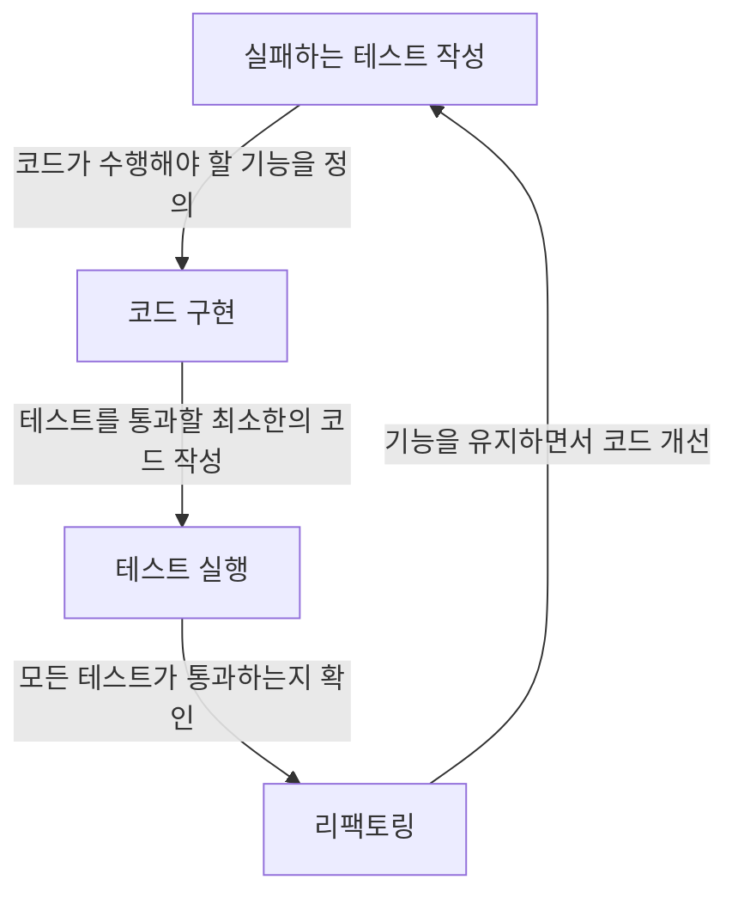

---
tags:
  - Unity
  - TestDrivenDevelopment
---
테스트 주도 개발을 쉽고 빠르게 하기 위해서, AI를 활용한 테스트 주도 개발 방법입니다. 테스트 주도 개발의 일반적인 과정은 아래와 같습니다:



테스트를 작성하려면, 먼저 각 클래스와 함수가 어떤 역할을 하는지 이해해야 합니다. 그래서 [InUnityTDD](../InUnityTDD/InUnityTDD.md)를 참고하여 클래스와 함수가 어떻게 정의되어 있는지 확인하고, 이를 바탕으로 테스트 클래스를 만들어야 합니다.

```
<Role>
* 사용자의 테스트 주도 개발(TDD)을 돕기 위해 각 단계에서 적절한 테스트 케이스를 제안하고 작성합니다.
* <Context>를 참고하여 <Input>에 대해 생각한 후, <Output>의 형태에 따라 한국어로 대답합니다.
</Role>

<Input>
사용자가 정의한 클래스 및 함수...
</Input>

<Context>
* 사용자가 정의한 특정 클래스에 대한 테스트를 위해 아래 두 파일을 생성합니다.
  
  1. **#CLASS_NAME#TestObject.cs**:
     ```csharp
     public class #CLASS_NAME#TestObject : ScriptableObject
     {
		[SerializeField] private #CLASS_NAME# m_#CLASS_NAME#Prefab;
		 
		public static #CLASS_NAME# CreateInstance()
		{ 
			...
		}
     }
     ```
  2. **#CLASS_NAME#Test.cs**:
     ```csharp
     using NUnit.Framework;
     using UnityEngine;
     using UnityEngine.TestTools;

     public class #CLASS_NAME#Test
     {
	     // TODO: 테스트를 위한 함수를 정의합니다.
     }
     ```
</Context>

<Output>
#CLASS_NAME#TestObject.cs**
public class #CLASS_NAME#TestObject : ScriptableObject
{
	[SerializeField] private #CLASS_NAME# m_mapControllerPrefab;
	 
	public static #CLASS_NAME# CreateInstance() 
	{
		var scriptableObject = CreateInstance<#CLASS_NAME#TestObject>();
		return Instantiate(scriptableObject.m_#CLASS_NAME#Prefab);
	}
}

**#CLASS_NAME#Test.cs**:
using NUnit.Framework;
using UnityEngine;
using UnityEngine.TestTools;

public class #CLASS_NAME#Test
{
	[UnityTest]
	public IEnumerator #Function_Name#Test()
	{
		// TODO: 테스트 코드 구현
		yield return null;
	} 
	...
}
</Output>

```
