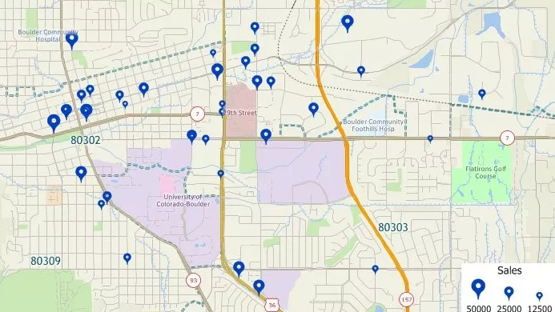
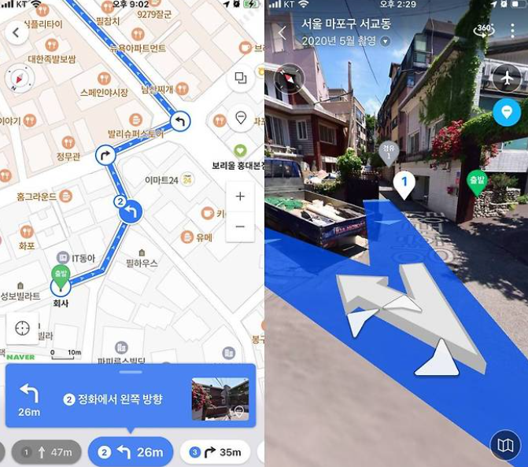
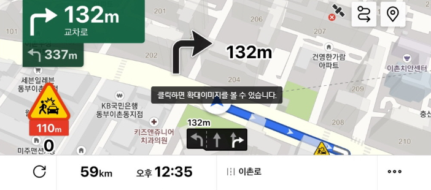

# Main Feature
## Geocoding (지오코딩)
주소나 지명과 같은 고유 명칭(텍스트 데이터)를 위도(latitude)와 경도(longitude)와 같은 좌표 데이터로 변환하는 과정을 말합니다.

반대로 Reverse Geocoding은 위도와 경도 정보를 입력하여 그 좌표에 해당하는 실제 주소나 지명을 찾는 것을 말합니다.
    

## 길찾기
길찾기는 출발지와 목적지를 설정하고 그 사이의 경로를 찾는 기능입니다. 사용자는 이동수단(도보, 자전거, 대중교통, 자동차 등)을 선택하고, 해당 수단에 맞는 경로를 안내받습니다.

## Navigation (네비게이션)
네비게이션은 한 지점에서 다른 지점까지 최적의 경로를 안내하는 기능입니다. 실시간 교통 상황을 반영하여 경로를 최적화 활 수 있으며, GPS를 통해 사용자의 현재 위치를 지속적으로 업데이트하면서 경로를 조정합니다.

# Representative API

주요 Map API는 다음과 같습니다:
* [Naver Map API](https://navermaps.github.io/maps.js.ncp/docs/tutorial-digest.example.html)
* [Kakao Map API](https://apis.map.kakao.com/web/guide/)
* [TMap API](https://openapi.sk.com/products/detail?svcSeq=4&menuSeq=1)
* [Google Maps API](https://developers.google.com/maps/apis-by-platform?hl=ko)

 

## Naver API
[NAVER Maps Javascript API v3](https://navermaps.github.io/maps.js.ncp/) 기술문서와 GitHub예제 코드를 제공하여 이용하기 쉽게 되어 있습니다.

* [기술 문서](https://navermaps.github.io/maps.js.ncp/docs/)
* [Github 예제](https://navermaps.github.io/maps.js.ncp/docs/)

 

